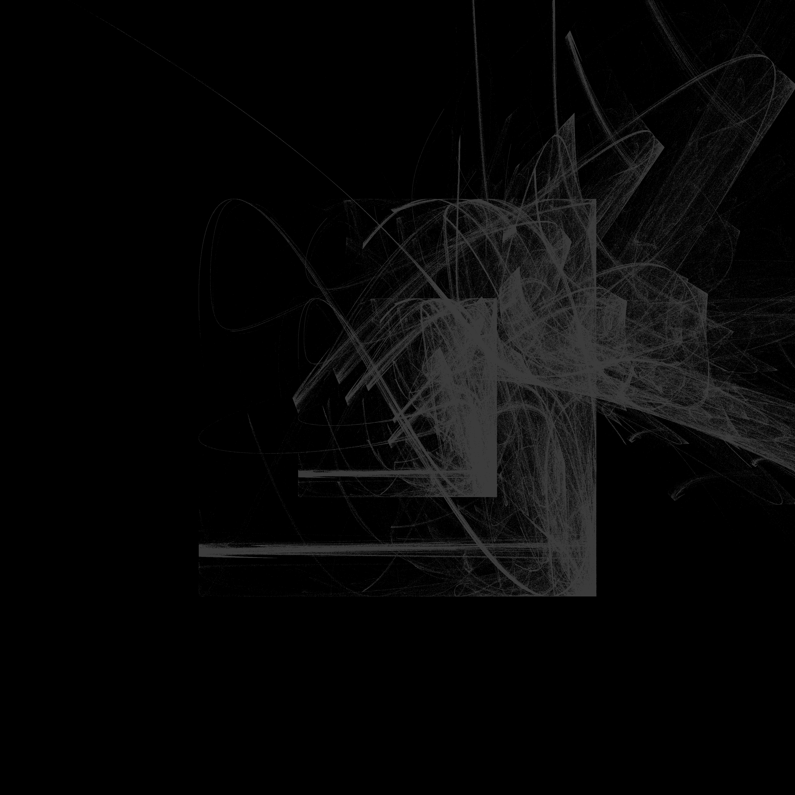

# Unboxing

A C (and webassembly) version of Danielle Navarro's [unboxing](https://blog.djnavarro.net/posts/2024-12-22_art-from-code-5/).




### Load R env (for running the R version)

```
conda create -n r-env r-essentials r-base
conda activate r-env
```

### References

1. https://blog.djnavarro.net/posts/2024-12-22_art-from-code-5/

```
@online{navarro2024,
  author = {Navarro, Danielle},
  title = {Art from Code {V:} {Iterated} Function Systems},
  date = {2024-12-22},
  url = {https://blog.djnavarro.net/posts/2024-12-22_art-from-code-5/},
  langid = {en}
}
```

2. https://keithfrost.github.io/2025-08-08-frac5.html


