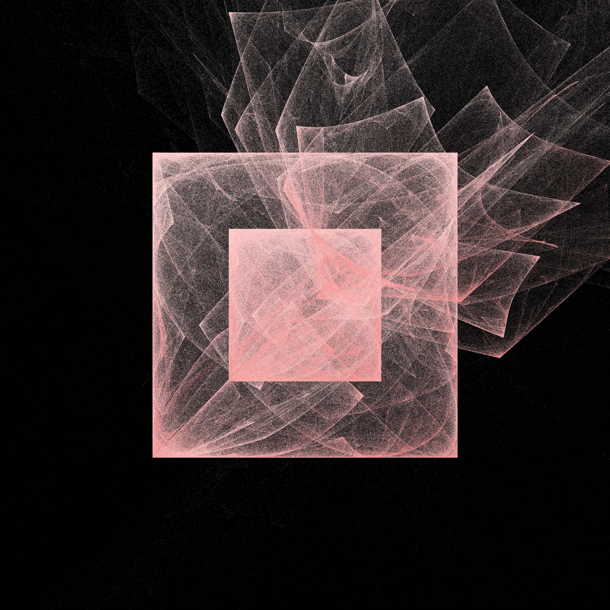
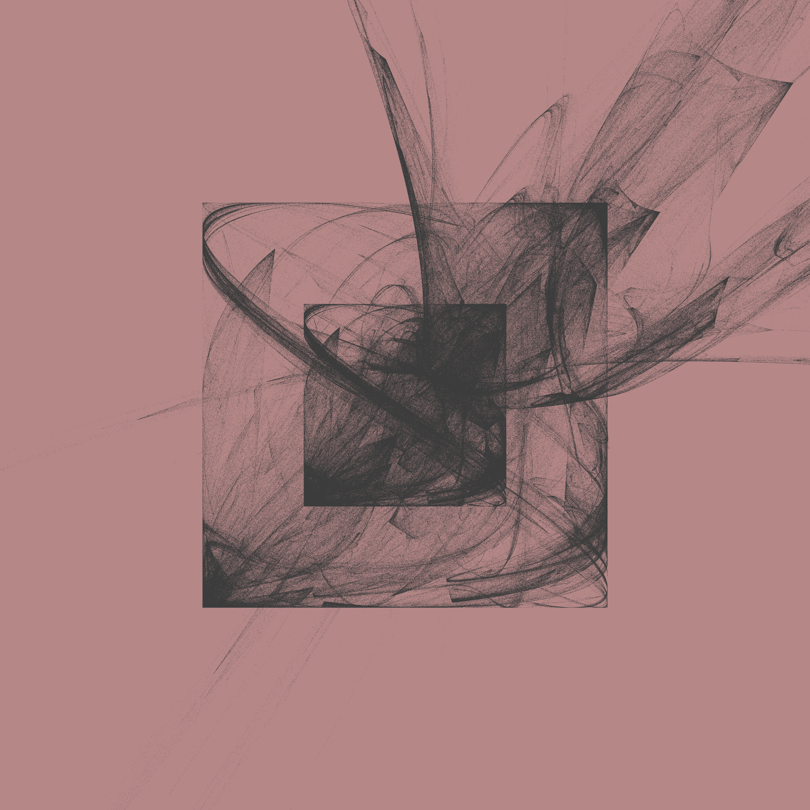
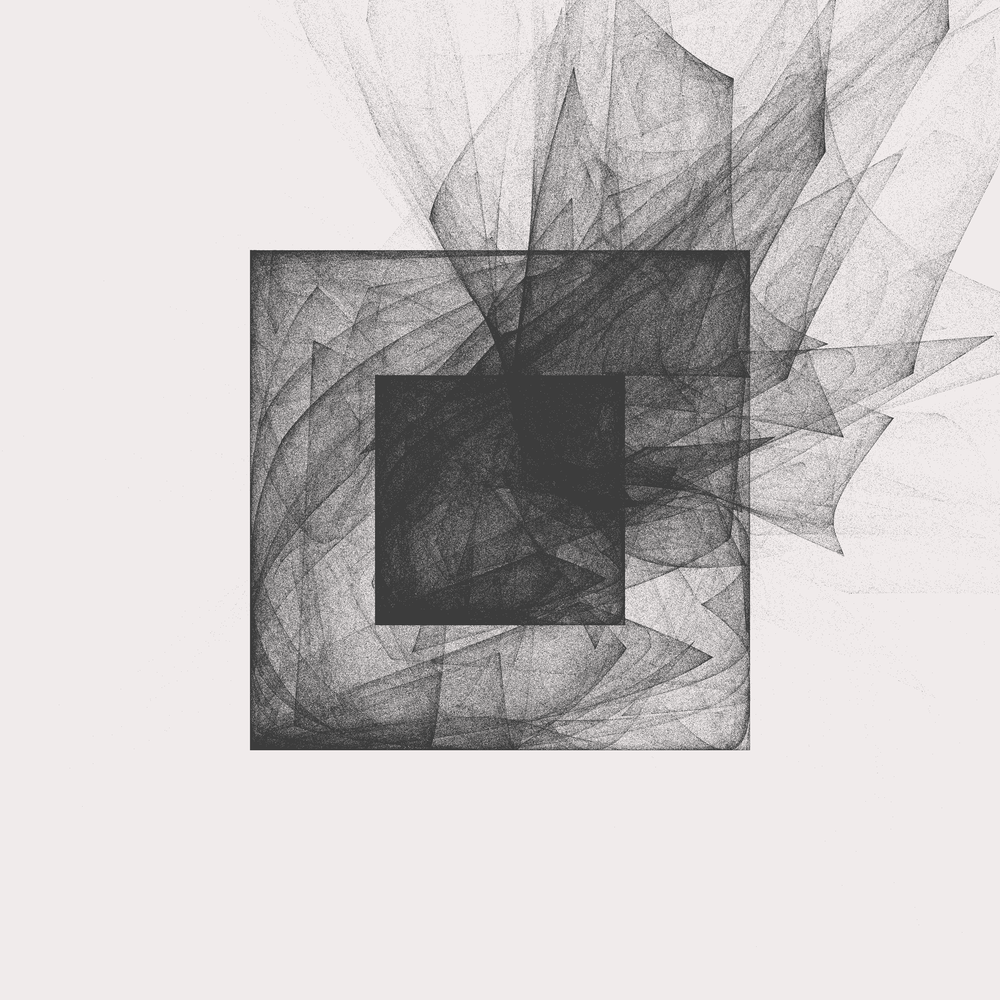

# Unboxing

[](https://github.com/drio/unboxing/actions/workflows/pages.yml)

A C (and webassembly) version of Danielle Navarro's [unboxing](https://blog.djnavarro.net/posts/2024-12-22_art-from-code-5/).

See the [live demo here](https://drio.github.io/unboxing/) for the webassembly version.

### Usage

To run the c standalone version (c compiler necessary - I use clang).

```sh
$ make 
...
$ ./unboxing 
create_fractal_image(): out screen points = 342298
INFO: FILEIO: [fractal.png] File saved successfully
INFO: FILEIO: [fractal.png] Image exported successfully
Image saved to fractal.png
$ open ./fractal.png
```

The webassembly version (The Emscripten Compiler Frontend "emcc" is required):

```sh
$ make web; make web-serve
...
Serving HTTP on 0.0.0.0 port 8787 (http://0.0.0.0:8787/) ...
# And open that URL with your browser
```

You can also generate a gallery:

```sh
$ cd gallery
$ make clean 
$ make -j12 COUNT=12 # 12 images per pallete (run 12 targets in parallel)
# And open the ./index.html with your browser
```


<div style="display: flex;">
  
  
  
  
  
  
  
  
  
</div>

### Load R env (for running the R version - testing purposes)

```
conda create -n r-env r-essentials r-base
conda activate r-env
```

### References

1. https://blog.djnavarro.net/posts/2024-12-22_art-from-code-5/

```
@online{navarro2024,
  author = {Navarro, Danielle},
  title = {Art from Code {V:} {Iterated} Function Systems},
  date = {2024-12-22},
  url = {https://blog.djnavarro.net/posts/2024-12-22_art-from-code-5/},
  langid = {en}
}
```

2. https://keithfrost.github.io/2025-08-08-frac5.html


